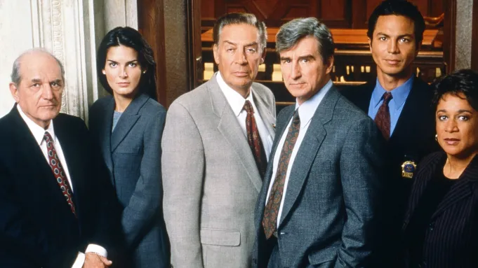
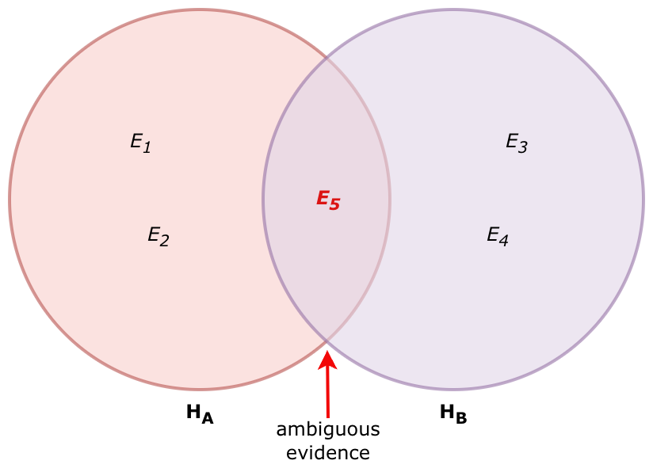

# The Big Picture

::: callout-note
## Chapter learning goals

- Think of the logic of social science as **inference to the best explanation**
- Appreciate the strengths and limitations of social science research
- Get an overview of the research project workflow
:::

## Introduction

This chapter launches your independent study by presenting you with the big picture; that is, it seeks to provide you with a sense of what social science is, how to go about it, and what you can reasonably expect to learn from it. The chapters that follow each present you with specific, concrete steps, strategies, and directives to help you move your research project forward. But to see how all the pieces fit together, we begin with a careful examination of the foundations underpinning the whole process.

## The logic of social science

{#fig-mansion fig-alt="Social science is a mansion with many rooms." fig-align="center"}

The broad field of knowledge known as social science is like a mansion with many rooms. Inside each room are groups of researchers concerned with particular types of problems or puzzles. Economists in one room discuss why some nations are rich while others are poor. In an adjoining room political scientists argue about why some democracies are stable while other regimes succumb to autocracy. Folks way down the hall or in another wing may be consumed with questions that economists and political scientists rarely consider, such as: *How is authoritative knowledge produced?* Or, *how declining vaccination rates impact public health in the future?*

Despite the rich variety and varied concerns that constitute the field, most social scientists agree on one thing: our goal is **to** **explain the social and political world**. It's that simple. The world presents us with problems or puzzles that we can't but would like to explain, so we go about trying to explain them.

### Social scientific reasoning

Most social scientists also share a distinctive (though not unique) way of approaching this goal. Sometimes called **inference to the best explanation** in the philosophy of science literature, the logic of social scientific inquiry often goes something like this:

> Given some data, and some candidate explanations or hypotheses that potentially explain that data, the explanation that is most compatible with the data is most likely to be true [adapted from @spirlingWhatGoodRegression2025].

Let's clarify this rather abstract logic by breaking it down into three concrete steps:

1.  Generate possible explanations based on some initial observation(s)

2.  Collect new data relevant to the implications of those explanations

3.  Adjudicate between rival explanations in light of that new data

These three steps are the foundation of most social science work, even if the term "inference to the best explanation" is rarely invoked. Interestingly, the logic of inference to the best explanation is quite common in other avenues of life outside the social sciences. To better familiarize ourselves with this form of reasoning let's consider three examples.

#### Everyday reasoning

{#fig-wet-grass fig-align="center" width="6.68in"}

The first example consists of a rather mundane puzzle many of us know from our everyday lives. Perhaps you've had the experience of waking up in the morning, looking outside the window, and wondering: why's the grass all wet? Without exerting any extra effort, many of us slip right into inferring to the best explanation, replicating the same three steps outlined above.

- First, we **generate possible explanations** for observing wet grass in the morning:

  - Overnight rain

  - Morning dew

  - Neighbor's sprinkler system

- Next, we **collect additional information** based on the implications of those explanations:

  - Check the weather app

    - Was rain in the forecast last night?
    - Was there high humidity yesterday?

  - Look outside again

    - Is the sidewalk or the road also wet?

- Finally, we **critically assess** what the new information implies about which explanation is more or less likely to be true.

  - If the app says there was a 35% chance of rain last night *and* the road and sidewalk are also wet, we gain confidence that overnight rain is the best explanation for wet grass in the morning.

#### Mysteries

::: {#fig-mysteries layout-ncols="2"}
{#fig-sherlock}

{#fig-law-and-order}

Mystery Shows
:::

A more explicit example of inference to the best explanation can be found in mystery stories, such as the novellas featuring famed fictional detective Sherlock Holmes or the many television crime and courtroom dramas found in the *Law & Order* extended universe. In cases such as these the puzzle to be explained is, of course, who committed the crime?

Though the stakes are very different than when explaining wet grass in the morning, the logic of inquiry is the same.

- First, the investigator generates a list of potential suspects based on the initial facts of the crime.

  - *Who had the means, motive, and opportunity?*

- Next, the investigator collects additional evidence to corroborate the suspects' alibis.

  - *Are there credible witnesses that can verify their whereabouts on the night in question?*

- Finally, the investigator rules out suspects as likely perpetrators based on new evidence collected.

  - *Suspect A was out of town the during night in question so they couldn't have committed the crime.*

#### Medical diagnoses

{#fig-the-pitt fig-align="center"}

HBO's hit drama series *The Pitt* is set in a hospital emergency room in downtown Pittsburgh. Each episode is a one-hour increment of a 12-hour day shift, depicting in real time the stressful and chaotic environment in which overburdened and under-resourced hospital staff try to help their patients.

While each patient arrives with a distinct situation, the underlying procedure is the same.

- Doctors generate a [differential diagnosis](https://en.wikipedia.org/wiki/Differential_diagnosis) based on a patient's symptoms

  - *Are they presenting fever? Where do they report experiencing pain? Could X be the cause? Could it be Y?*

- Doctors then order lab tests and/or check patient for additional symptoms consistent with the contending diagnoses

  - *What do the x-ray results show? Do their pupils respond normally to light?*

- The doctors then rule out diseases or injuries inconsistent with lab results, and make a final diagnosis

  - *Based on this set of symptoms and a positive test result, the patient is most likely suffering from X.*

As these examples illustrate, inference to the best explanation is a common form of reasoning found in diverse settings outside of social science. But it is also foundational to the work of social scientists and the kind of research you'll do in this independent study. Let's now consider an example found within the halls of social science.

#### The rise of right wing populism

{#fig-populism fig-align="center"}

One of the major debates currently animating political science concerns explaining the rise of right wing populism across the world over the last few decades [@bermanCausesPopulismWest2021]. Despite the clear differences from everyday life, murder mysteries, and emergency rooms, we can see inference to the best explanation at work in this field as well.

- Researchers theorize potential explanations based on initial observations of rising right wing populism

  - *Economic grievance*
  - *Sociocultural grievance*
  - *Government dysfunction*
  - *Entrepreneurial politicians*

- Next, researchers collect data to test implications of rival explanations

  - *Does low socioeconomic status increase voters' support for populist candidates?*
  - *Is there a relationship between anti-immigrant attitudes and populist electoral success?*
  - *Is there growing citizen dissatisfaction with political institutions?*
  - *Do establishment politicians marginalize or accomodate populist insurgents?*

- Finally, researchers adjudicate between rival explanations in light of the new data

  - *Which explanation is most compatible with the data?*

Let's pause here to recognize how this example rehearses the description of social science research offered on the Welcome page of this guide. While we've added the label "inference to the best explanation" in this chapter, we are only re-describing the research process in terms of the particular way social scientists reason while doing their research.

It begins with an initial observation—wet grass, a robbery, a feverish patient, or the election of a populist leader—which presents us with a **problem or puzzle** in need of explanation. Having been puzzled by this initial observation, we generate potential **theories**, often in **conversation** with other specialists, to explain it. To assess which theory is most compatible with the data, we **gather additional information** by testing the theories' empirical implications, asking ourselves *if theory A is true, what would I expect to see in the world?* The total weight of evidence collected in **hypothesis testing** helps us infer which theory or explanation is most likely to be true.

::: callout-tip
## Making connections

We've offered a range of cases in which **inference to the best explanation** can be applied. Can you think of some examples from your own life (personal life, tv or books, high school or other college courses) in which you've applied similarly reasoning?
:::

## Strengths and limitations of social science research

As an approach to explaining the world's social and political problems, inference to the best explanation is an elegant model of social science reasoning and is evident in the best social science work. Such an analytic approach has clear strengths across its many fields of application but also some important limitations that all social scientist researchers who use it should be aware of.

### Strengths

#### *Inclusivity*

As a logic of inquiry, inference to the best explanation embraces a broad, encompassing definition of "explanation." Depending on the particular question under examination, an explanation could be either *descriptive* or *causal* in nature. For instance, if we are concerned with the question, "what is populism," an explanation would include a clear definition of its main attributes or characteristics and perhaps some empirical indicators that could help us identify or measure the presence or absence of those populist attributes.

However, if the question was "what is causing the spread of populism today," then an explanation would need to go beyond simply describing what populism is. We'd also need to offer some theory and hypotheses concerning which causal factors are at work in producing the phenomenon in the first place (as we discussed in the example above).

Some social scientists assert that explanation requires a causal account [@KKV]. The approach embraced in this guide suggests that such a narrow perspective unduly excludes important and valuable descriptive projects from the halls of social science, and regards causal and non-causal explanations as equally legitimate contributions to the field [@dowdingExplanatoryPluralismPolitical2025].

#### *Bias mitigation*

We all like to be right, and we often resist being wrong, even if we do so unconsciously. For better or worse, human beings construct mental models of how the world works, and these models affect how we process new information [@kahnemanThinkingFastSlow2013]. Just like everyone else, social scientists are prone to various forms of cognitive bias, including confirmation bias, which is when we "seek only information that would confirm a guess or hypothesis but no information that would contradict it" [@toshkovResearchDesignPolitical2025, p. 11].

This is a very common problem, both in student papers as well as professional peer-reviewed studies. The potential influence of confirmation bias often shows up like this:

> To explain the rise of right wing populism I theorize that growing populist sentiment in the public is rooted in widespread economic grievances. After collecting data on income inequality and voting patterns across US congressional districts, I found a strong positive correlation between economic disparity and the vote share of populist candidates.

What's wrong with this argument? On its own, nothing. It posits a plausible relationship between economic grievance and the phenomenon of interest, and it proposes a reasonable hypothesis to test by measuring the strength of the correlation between income disparities and voting patterns in US congressional districts.

But how does the author know that this economic explanation of populism is the "best" one? By limiting the analysis to only one possible theory—oftentimes the one we already prefer—we can't know how it compares to other rival explanations. Maybe districts with high income inequality also have large immigrant populations, such as urban areas, which could influence voting behavior independently of economic factors? This is the social-science equivalent of a doctor who prematurely jumps to a final diagnoses without exploring the full range of symptoms and possible causes.

The approach of this guide mitigates this form of cognitive bias (at least somewhat) by explicitly generating multiple possible explanations for some phenomenon of interest as a first step. The social and political world is a complex place. Very few problems or puzzles that are worthy subjects of a research project have a single, clear explanation. When in conversation with the literature (see Chapter 3), you'll likely be able to apply two or three contending theories to your problem or puzzle of interest, ensuring that you've at least considered rival explanations and tested their inferential power against your favored theory.

When these rival theories are drawn from a diverse body of scholarship, written from diverse perspectives, this approach can also cultivate an awareness of our own positionality as researchers and help us cross-examine the assumptions we bring to our work [@grossmannHowSocialScience2021]. This not only helps to create a more inclusive field but also better explanations.

#### *Guidance for gathering evidence*

Every good detective bases their investigation around a set of clues—pieces of evidence that indicate where to look for more information. Detectives need that additional information in order to discriminate between rival explanations, to eliminate persons of interest from their list potential suspects, and focus their investigation on the most likely perpetrator.

We do a similar thing in social science. Once we have a set of rival explanations for some phenomenon of interest, we need to collect evidence that can help us adjudicate between them. Data collection is one of the most time consuming parts of the research workflow. Luckily, inference to the best explanation makes such a task more productive by guiding us toward the most potentially impactful data while avoiding ambiguous evidence.

What exactly is "ambiguous evidence"? To illustrate, let's return to our detective story. Say Sherlock Holmes is investigating a burglary, and he has narrowed down his list of two potential suspects. He spends the first day of the investigation going around London to verify their whereabouts the night before. As it turns out, both suspects were in town during the night in question. So, what has Holmes learned from his day-long effort? Very little. While logically necessary, the mere fact of "being in town the night of the burglary" is insufficient on its own to help Holmes narrow down who did it.

{#fig-venn fig-align="center"}

@fig-venn presents a Venn diagram to help us see why this is the case. The two circles represent two competing hypotheses, abbreviated as $H_A$ and $H_B$. The $E$s inside the circles represent five different pieces of evidence: $E_1$ and $E_2$ are implied by $H_A$; $E_3$ and $E_4$ are implied by the rival $H_B$. Evidence $E_5$ (marked in [bold red]{style="color: red"} font in the diagram's overlapping section) is implied by *both* $H_A$ and $H_B$. In terms of helping us adjudicate which hypothesis is more likely to be true, $E_5$ is ambiguous. For Holmes, this piece of evidence—that both suspects were in town the night of the crime—fails to discriminate between his rival hypotheses because such a fact is compatible with both theories of who did it.

To apply this idea to social science, consider a particularly tricky problem for researchers working in the domain of American election studies. The enactment of strict voter identification laws across many states has created a concern that these laws may disproportionately burden low-income and non-White citizens who are more likely to lack official forms of government ID, such as drivers licenses or passports. The argument is that voter turnout may decline $(H_A)$ as a result. The problem is that measuring the influence of new voter ID laws on turnout is very difficult [@hightonVoterIdentificationLaws2017; @grimmerObstaclesEstimatingVoter2018]. Simply looking to see if turnout went down at the next election $(E_5)$ is not enough on its own. Even if such a measurement registered a decline, that piece of evidence is fully compatible with the rival hypotheses $(H_B)$, that turnout fluctuates from election to election regardless of any changes in ID laws.

So, by entertaining multiple potential explanations from the start, inference to the best explanation orients us toward collecting *discriminating* evidence—evidence that we'd expect to see if $H_A$ is true but would be very surprised to see if $H_B$ were true (or the other way around). This helps us avoid spending our precious time looking for evidence that is compatible with multiple rival explanations, which doesn't help us infer which one is more likely to be true.

### Limitations

#### *Uncertainty*

While social scientists do their research in pursuit of the truth, we never quite arrive at our final destination. No matter how much time, effort, and resources we put into our research, social scientists rarely (if ever) know anything with absolute certainty, such as the certainty with which we can confidently state that $2 + 2 = 4$.

Most of what we want to know when it comes to big, important topics like populism, democracy, inequality, and so on, falls outside the range of our direct experience—that is, what we perceive in our immediate environment. More like doctors, detectives, and courtroom lawyers, we are forced by the questions we ask to *infer* explanations based on necessarily incomplete information. We can posit rival explanations, collect discriminating evidence, and find that one theory is much better supported than another. But some degree of uncertainty will always remain.

Whether large or small, this remaining uncertainty is often seen by students and professionals as a source of embarrassment or potential disqualification, as if it means they didn't do their work well. But this is not necessarily the case. In some circumstances uncertainty can be quite enlightening.

For example, consider again the rise of right wing populism. If we found mixed empirical support for both the economic versus the sociocultural grievance theories, we would be left with substantial uncertainty about which explanation is most likely to be true. However, this finding may be interpreted as compelling evidence in itself for revising our theory of populism. If both economic and sociocultural grievance theories get somethings right and somethings wrong, we may be able to go back to the drawing board and fashion a new explanation that combines the best of both. Subsequent testing of our new theory's empirical implications may help reduce our initial uncertainty.

As a transparent and collaborative enterprise intended to address the world's social and political problems, social science must be upfront and explicit about uncertainty. This implies that we continue to pursue the truth but without the expectation (or pretension) of achieving absolute certainty about anything. This is not to say that social scientists know nothing. Generations of researchers have learned quite a lot. Rather, it is to emphasize that social scientists conduct their research in the language of confidence, likelihood, and plausibility. We can be highly confident that we understand, say, how populism works, but our knowledge about populism or anything else always remains tentative and provisional on new, potentially surprising information that may be discovered.

#### *When explanations aren't mutually exclusive*

Our prior discussion about uncertainty poses an important question: what if our explanations are not mutually exclusive? What if our rival theories are not actual rivals? The previous example suggested that economic and sociocultural grievance theories of populism could potentially be combined. So why not just combine theories from the start? Why bother with positing multiple contending explanations at all?

In order to know which explanation is "best," our explanations need to be mutually exclusive, meaning that one and only one can be true. We've already discussed some of the strengths that attend this form of reasoning: mitigating cognitive biases, guidance toward potentially most impactful evidence, and so on. But with some careful wording, our rival explanations can accommodate a wide range of possibilities.

For instance, in our Sherlock Holmes example above, the famed detective has a list of only two suspects. But this need not limit him to only two rival explanations. He could reformulate this explanations like this:

1.  $H_A$: Suspect A committed the burglary

2.  $H_B$: Suspect B committed the burglary

3.  $H_C$: Suspects A and B colluded in the commission of the burglary

The third hypothesis $H_C$ is a combination of the other two $H_A$ and $H_B$. But recognize that all three hypotheses are still mutually exclusive. Logically, only one of them can be true. If, say, number 3 is true, then 1 and 2 must be false. If 1 is true, then 2 and 3 are false. And so on.

We can apply the same elaboration of explanations to the case of populism.

1.  $H_A$: Economic grievance is the primary factor fueling populism

2.  $H_B$: Sociocultural grievance is the primary factor fueling populism

3.  $H_C$: A specific combination of economic and sociocultural grievances fuel populism

Formulating our potential explanations as rivals is important because it prepares us to look for at least some kind of discriminating evidence out there in the world. (We already know that some theories predict the same evidence as we saw with $E_5$ in the overlap of the Venn diagram above.) This helps us infer which explanation is best among the stated alternatives, even though some uncertainty will always remain.

In practice, adding language that forces our explanations to be posed as strict rivals is necessary [@fairfieldSocialInquiryBayesian2022]. But this need not restrict the kinds of explanations that we can test.

#### *Explanations not considered*

By definition, inference to the best explanation seeks to discover which explanation *from a given set of explanations* best fits with the evidence we've collected. But as some have objected: what if the truly best explanation isn't included in our set of candidate explanations? Do we end up just picking "the best of a bad bunch"? How do we know we have a good set of candidate explanations when there is logically an infinite number of possible explanations?

It is true that we cannot empirically test explanations that we haven't thought of, but that is a liability of all human thinking, not just social science. I may incorrectly infer that overnight rain is the best explanation for why the grass is wet in the morning when in fact a nearby water main ruptured and showered the whole neighborhood. Rare or unusual events that have a low probability of occurring are likely to be overlooked as candidate explanations.

Fortunately for social scientists, one aspect of our field may help mitigate such oversights: namely, joining the conversation of likeminded specialists. By engaging with the existing literature on our problem or puzzle, we learn about the leading explanations for the phenomenon that interests us (again, see Chapter 3). Many hardworking people have worked on some of these problems for many years. This doesn't mean they've thought of everything, but it does mean that we can use their work to help us craft a set of viable contenders for testing (including, of course, novel explanations we may theorize ourselves).

It is also true that we could dream up an infinite number of potential explanations. Some, like the water main example, could be plausible but unlikely. Others, such as space aliens controlling Donald Trump's mind, are not only unlikely but highly implausible. So while in theory the list of potential explanations could go on forever, in practice we limit ourselves to those that are mutually exclusive and have a high degree of likelihood (usually between 2 and 5).

## The research project workflow

Let's wrap up our tour of the big picture with an overview of this semester's scaffolded research project. @fig-workflow displays a diagram representing the research workflow.

{#fig-workflow .fig-workflow fig-align="center" width="11in"}

There's a lot going on in this diagram, and it will reappear throughout this guide, so let's examine it carefully piece by piece, drawing out the key insights it is meant to represent.

### Research as a conversation

The first thing to notice is that the research workflow is a cycle, beginning and ending with the state of **existing knowledge**. We draw from it when we learn about a subject that interests us, and we contribute to it when we communicate our findings to audiences and stakeholders. As researchers, our intention is to extend the frontiers of knowledge, even if only modestly, leaving the field in a better place than when we found it.

### Research as an iterative process

The blue-shaded bubbles surrounding the state of knowledge represent distinct stages of the research process. The solid black arrows trace a clockwise workflow through the cycle, from developing our initial **topic, problem/puzzle, and question** in the top-right corner to writing up our **findings and implications** at the top-left. The dashed black arrows trace a counter-clockwise workflow, working backward through the stages. This is meant to capture that although the workflow looks chronological, real-world research typically moves back and forth between stages, recursively and iteratively revising and refining previous stages as we move forward to new ones.

We'll implement iterative research in this independent study in a cumulative, stepwise fashion. After having completed one stage, you'll move on to the next. In the interim, I'll offer you some feedback on stage 1, which you'll revise and hand in with stage 2, and so on, working your way through the cycle by recursively doubling back to revise and refine as you go. Not only does this workflow typically produce much better research, but it more accurately resembles the research practices of professional social scientists.

### Research as a set of deliverables

There are also two red-shaded deliverables that are spun out of the workflow at various points. A formal **research proposal** is expected around the midpoint in the semester and a polished **research paper** is expected at the end. (See the syllabus for specific details regarding expectations and assessment criteria.)

As the semester proceeds, we'll spend significant time unpacking each and every one of these stages as you move your project through the research workflow, providing advice and clarity about what is expected at each juncture. The chapters that follow do precisely that.

## Conclusion

Be a mindful learner
