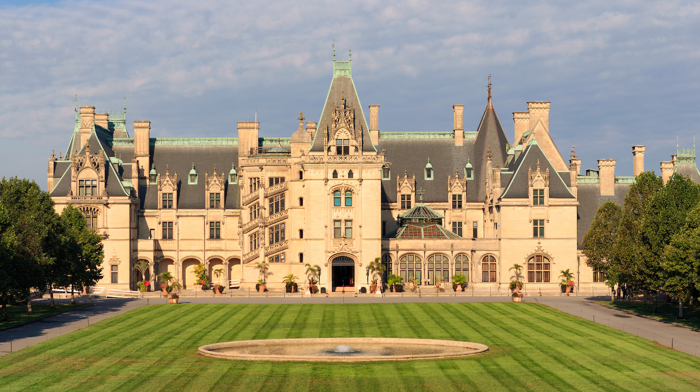
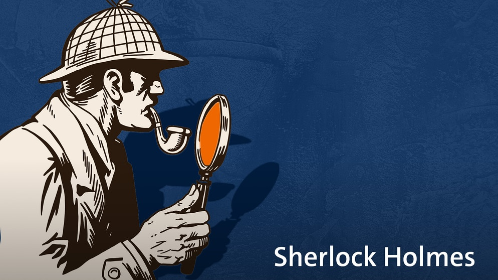
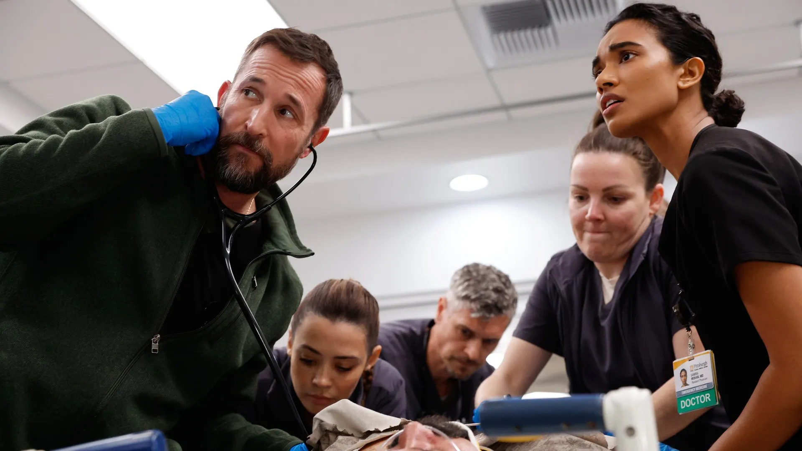

# Introduction: The Big Picture

::: callout-note
## Chapter learning goals

- Consider the logic of social science as inference to the best explanation
- Develop an overview of the research project workflow
- Appreciate the strengths and limitations of social science research
:::

This chapter provides an overview of the what I call the big picture: that is, what social science is all about, how to go about it, and what we can reasonably expect to learn from it. The chapters that follow address specific steps or stages of the research process. But in order to see how they fit together, we need to develop a sense of the underlying logic of inquiry that links all those stages together.

## The logic of social science: inference to the best explanation

{fig-align="center"}

The broad field of knowledge known as social science is like a large mansion with many rooms. Inside each of those rooms are groups of researchers concerned with a particular type of problem or puzzle. *Why are some nations rich and others poor? Why do some economies industrialize and others stagnate?* Neighboring rooms contain specialists concerned with similar problems. *Why are most stable democracies rich while poor democracies succumb to autocrats?* Rooms down the hall or in another wing of the building are consumed with questions that may seem largely unrelated. *If the US raised the federal minimum wage to \$20 per hour, what would happen to the unemployment rate? How has the declining US birthrate affected gender relations in the average household?*

Despite the rich complexity that constitutes the field, most social scientists agree on one thing: that the goal of social science is to **explain the social and political world**. It's that simple. The world presents us with problems or puzzles that we can't but would like to explain, so we go about trying to explain them.

### Social scientific reasoning

Social scientists have a distinctive (though not unique) way of approaching their task of explaining the social and political world. Sometimes called **inference to the best explanation**, the distinctive logic of social scientific inquiry goes like this:

> Given some data, and some candidate explanations or hypotheses that potentially explain that data, the explanation that is most compatible with the data is most likely to be true [adapted from @spirlingWhatGoodRegression2025].

This abstract approach can be made more concrete by breaking it down into three key steps:

1.  Generate possible explanations based on some initial observation(s)
2.  Collect new data relevant to the implications of those explanations
3.  Adjudicate between rival explanations in light of that new data

While these steps are the touchstone of most social science literature, this logic of inference to the best explanation is actually quite common in other avenues of our lives. Let's consider three examples.

#### Everyday reasoning

{fig-align="center" width="6.68in"}

The first example consists of a rather mundane puzzle we know from our everyday lives. It's a common experience to wake up in the morning, look outside our window, and wonder: why's the grass wet? Without exerting any extra effort, many of us slip right into inference-to-best-explanation mode.

First, we generate possible explanations for observing wet grass in the morning:

- Overnight rain
- Morning dew
- Neighbor's sprinkler system

Then, we collect additional information based on the implications of those explanations:

- Check the weather app on our phone
  - Was rain in the forecast last night?
  - Was there high humidity yesterday?
- Check outside
  - Is the sidewalk or the road also wet?

Finally, we critically assess what the new information implies about which explanation is more or less likely to be true.

#### Mystery stories

{fig-align="center"}

A more explicit example of inference to the best explanation can be found in mystery stories, such as the novels featuring famed fictional detective Sherlock Holmes or the many television crime and courtroom dramas found in the *Law & Order* extended universe. In instances such as these, the puzzle to be explained is, of course, who committed the crime?

Though very different than explaining why the grass is wet in the morning, the logic is the same.

- First, the investigator generates a list of potential suspects based on the initial facts of the crime.
  - *Who had the means, motive, and opportunity?*
- Next, the invesigator collects additional evidence to corroborate the suspects' alibis.
  - *Are there credible witnesses that can verify their whereabouts?*
- Finally, the investigator excludes suspects as likely perpetrators based on evidence collected.
  - *Suspect A was out of town the during night in question and couldn't have committed the crime.*

#### Medical diagnoses

{fig-align="center"}

HBO's hit series *The Pitt* is set in a hospital emergency room in downtown Pittsburgh, Pennsylvania. Each episode takes place during one hour of a 12-hour shift, displaying in real time the stressful and chaotic environment in which overburdened and underresourced hospital staff try to help their patients.

While each patient arrives with a distinct emergency, the underlying logic of diagnosis is the same.

- Generate differential diagnosis based on patient's symptoms
  - *Are they presenting fever? Where do they report experiencing pain?*
- Order lab tests or check patient for additional symptoms
  - *What does the x-ray show? Do their reflexes respond normally?*
- Rule out diseases or injuries inconsistent with lab results and make final diagnosis
  - *Based on this set of symptoms and a positive test result, the patient is likely suffering from X*

#### Political science: explaining the rise of right wing populism

{fig-align="center"}

As the examples above illustrate, inference to the best explanation is a common form of reasoning found in diverse settings outside of social science. But of course it is foundational to the work of social scientists as well.

Consider one of the major debates currently animating political science: the rise of right wing populism [@bermanCausesPopulismWest2021].

- Theorize potential explanations based on initial observation
  - *Economic grievance*
  - *Sociocultural grievance*
  - *Government dysfunction*
  - *Entrepreneurial politicians*
- Collect data to test implications of rival explanations
  - *Does low socioeconomic status increase voters' support for populist candidates?*
  - *Is there a cross-country relationship between anti-immigrant attitudes and populist electoral success?*
  - *Is there growing citizen dissatisfaction with political institutions?*
  - *How do establishment politicians respond to populist insurgents?*
- Adjudicate between rival explanations in light of new data
  - *Which explanation (or combination of explanatory factors) is most compatible with the data?*

## The research project workflow

Let's start by taking a bird's eye view of this semester's research project as a whole. @fig-workflow displays a diagram representing the research workflow, starting and ending with the state of existing knowledge.

{#fig-workflow .fig-workflow fig-align="center" width="11in"}

There's a lot going on in this diagram, so let's explain it piece by piece. The blue-shaded bubbles represent distinct stages of the research process. The solid arrows trace a clockwise workflow from **topic** in the top-right corner to **findings and implications** near the top-left. The dashed arrows trace a counter-clockwise workflow back through the stages. This is meant to capture that although the workflow looks chronological, real-world research typically iterates back and forth between stages, recursively revising and refining previous stages as we move forward to new ones.

There are also two red-shaded deliverables that are spun out of the workflow at various points. A formal **research proposal** is expected around the midpoint in the semester and a polished **research paper** is expected at the end.

As the semester proceeds, we'll spend significant time unpacking each and every one of these stages as you move your project through the research workflow. I'll also clarify precisely what is expected in the research proposal and paper. The chapters that follow do precisely that. For now, to get a better sense of the big picture, let's take a brief tour through the workflow.

***`Existing knowledge`***

All research projects begin and end with the state of existing knowledge. We draw from it when we learn about a subject that interests us, and we contribute to it when we communicate our research findings to audiences and stakeholders. As researchers, our intention is to extend the frontiers of knowledge, even if only modestly, leaving the field in a better place than when we found it.

***`Topic, problem/puzzle, question`***

While existing knowledge typically plays an implicit, background role, in the formation of research projects, specific topics, problems, puzzles, or questions are usually top of mind in the formation of research projects.

***`Join the conversation`***

***`Theory and hypotheses`***

***`Research design`***

***`Data collection and analysis`***

***`Findings and implications`***

### Inference is the goal

There's a common misconception among new students in the social sciences that they will find a single correct answer to their research question—something along the lines of, say, $2 + 2 = 4$.

Inference is simply the act of making claims that go beyond the particular evidence examined [@KKV].

But if by *answer* we mean a transparently reasoned, evidence-based conclusion that is amenable to future updating based on new evidence, then let me reassure you that you're ready for the challenge that awaits you.

The process by which we arrive at this transparently reasoned, evidence-based, and always-tentative conclusion goes by the name **inference**, and it is the basis of all social science research. According to its [Wikipedia entry](https://en.wikipedia.org/wiki/Inference), inference is simply a "conclusion reached on the basis of evidence and reasoning." Why must we infer?

We make so many inferences in our everyday lives, we may not even consciously notice. When we wake up and find that the sidewalk is wet, we infer that it rained overnight. When you see a friend sitting down to have a snack, you may infer that they're hungry. If you find your roommate packing a bag, you might infer that they are going away for the weekend.

In the social sciences, we make inferences about other kinds of phenomena, but the logic is the same. After observing a polity's electoral process, we may classify the regime as either a democracy or an autocracy. To survey public opinion, we typically rely on a representative sample from which we generalize about the whole population. If the economy enters a recession, we may expect an incumbent's chances of reelection to diminish.

These examples of inference from both everyday life and the social sciences have something in common: they all occur under conditions of **uncertainty**. This is why social science research is fundamentally unlike concluding that $2 + 2 = 4$. The simple definition of the equation's symbols provides us with complete information and makes the conclusion logically inescapable. We can claim that $2 + 2 = 4$ with absolute certainty.

When it comes to social science, we not so lucky. Typically, we operate with incomplete information and must form our conclusions carefully to account for uncertainty. We may think that it was the economic recession that doomed the president's reelection, but perhaps it was a corruption scandal that was top of mind for voters that year. Needing to do our research under conditions of uncertainty makes social science challenging but also interesting and ultimately rewarding.

### Inference and explanation

The centrality of inference to social science research may feel a little deflating at first. It is natural to want to find clear and definite answers to questions of widespread public concern and political importance. Does the ubiquity of uncertainty mean that we can't really explain anything?

Why do much uncertainty? There are multiple sources of uncertainty when conducting research on the social and political world [@gailmardStatisticalModelingInference2014, p. 73].

### A pluralist methodology

I'll conclude this introductory chapter with a brief statement intended to clarify the methodological underpinnings of the research advice contained in this book. Social science can be thought of as a mansion with many rooms,

Philosophically, this book embraces what's called methodological pluralism. This particular view of social science follows from the principles laid out above. If we as researchers operate under conditions of uncertainty and our inferences are always tentative and subject to revision, then it's best that we take a broadly inclusive approach to social science research. Gatekeeping—that is, judging what is and *is not* legitimate social science—can be a harmful and unproductive practice, and is

This is not the same as saying that social science is a field in which "anything goes." As we've established, there are standards that must be met.
