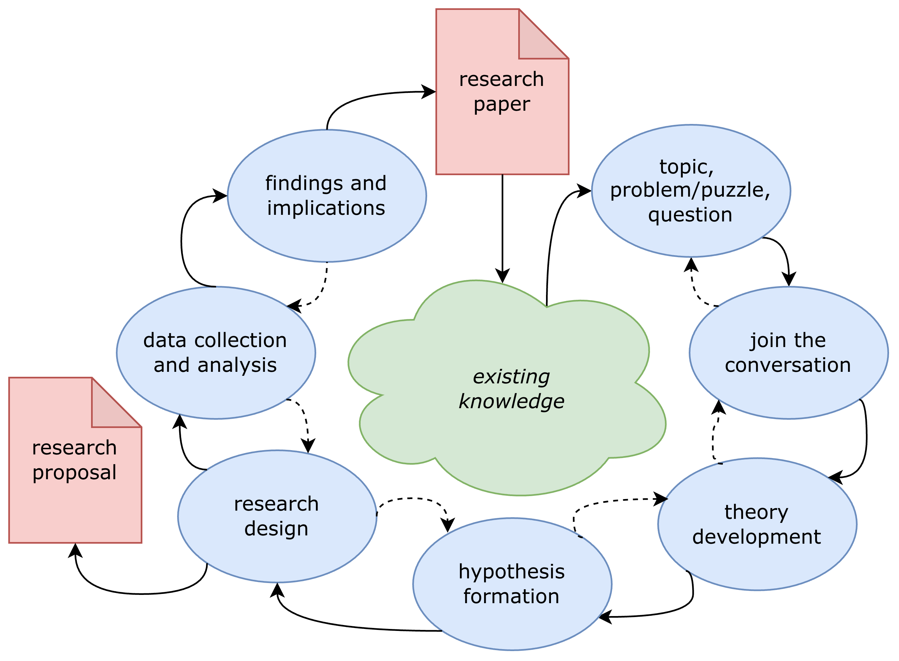

# Introduction: The Big Picture

### The research paper workflow

Let's start by taking a bird's eye view of this semester's research project as a whole. @fig-workflow displays a diagram representing the research workflow, starting and ending with the state of existing knowledge.

{#fig-workflow .fig-workflow fig-align="center" width="11in"}

There's a lot going on in this diagram, so let's explain it piece by piece. The blue-shaded bubbles represent distinct stages of the research process. The solid arrows trace a clockwise workflow from **topic** in the top-right corner to **findings and implications** near the top-left. The dashed arrows trace a counter-clockwise workflow back through the stages. This is meant to capture that although the workflow looks chronological, real-world research typically iterates back and forth between stages, recursively revising and refining previous stages as we move forward to new ones.

There are also two red-shaded deliverables that are spun out of the workflow at various points. A formal **research proposal** is expected around the midpoint in the semester and a polished **research paper** is expected at the end.

As the semester proceeds, we'll spend significant time unpacking each and every one of these stages as you move your project through the research workflow. I'll also clarify precisely what is expected in the research proposal and paper. The chapters that follow do precisely that. For now, to get a better sense of the big picture, let's take a brief tour through the workflow.

***`Existing knowledge`***

All research projects begin and end with the state of existing knowledge. We draw from it when we learn about a subject that interests us, and we contribute to it when we communicate our research findings to audiences and stakeholders. As researchers, our intention is to extend the frontiers of knowledge, even if only modestly, leaving the field in a better place than when we found it.

***`Topic, problem/puzzle, question`***

While existing knowledge typically plays an implicit, background role, in the formation of research projects, specific topics, problems, puzzles, or questions are usually top of mind in the formation of research projects.

***`Join the conversation`***

***`Theory and hypotheses`***

***`Research design`***

***`Data collection and analysis`***

***`Findings and implications`***

### Inference is the goal

There's a common misconception among new students in the social sciences that they will find a single correct answer to their research question—something along the lines of, say, $2 + 2 = 4$.

Inference is simply the act of making claims that go beyond the particular evidence examined [@KKV].

But if by *answer* we mean a transparently reasoned, evidence-based conclusion that is amenable to future updating based on new evidence, then let me reassure you that you're ready for the challenge that awaits you.

The process by which we arrive at this transparently reasoned, evidence-based, and always-tentative conclusion goes by the name **inference**, and it is the basis of all social science research. According to its [Wikipedia entry](https://en.wikipedia.org/wiki/Inference), inference is simply a "conclusion reached on the basis of evidence and reasoning." Why must we infer?

We make so many inferences in our everyday lives, we may not even consciously notice. When we wake up and find that the sidewalk is wet, we infer that it rained overnight. When you see a friend sitting down to have a snack, you may infer that they're hungry. If you find your roommate packing a bag, you might infer that they are going away for the weekend.

In the social sciences, we make inferences about other kinds of phenomena, but the logic is the same. After observing a polity's electoral process, we may classify the regime as either a democracy or an autocracy. To survey public opinion, we typically rely on a representative sample from which we generalize about the whole population. If the economy enters a recession, we may expect an incumbent's chances of reelection to diminish.

These examples of inference from both everyday life and the social sciences have something in common: they all occur under conditions of **uncertainty**. This is why social science research is fundamentally unlike concluding that $2 + 2 = 4$. The simple definition of the equation's symbols provides us with complete information and makes the conclusion logically inescapable. We can claim that $2 + 2 = 4$ with absolute certainty.

When it comes to social science, we not so lucky. Typically, we operate with incomplete information and must form our conclusions carefully to account for uncertainty. We may think that it was the economic recession that doomed the president's reelection, but perhaps it was a corruption scandal that was top of mind for voters that year. Needing to do our research under conditions of uncertainty makes social science challenging but also interesting and ultimately rewarding.

### Inference and explanation

The centrality of inference to social science research may feel a little deflating at first. It is natural to want to find clear and definite answers to questions of widespread public concern and political importance. Does the ubiquity of uncertainty mean that we can't really explain anything?

Why do much uncertainty? There are multiple sources of uncertainty when conducting research on the social and political world [@gailmardStatisticalModelingInference2014, p. 73].

### A pluralist methodology

I'll conclude this introductory chapter with a brief statement intended to clarify the methodological underpinnings of the research advice contained in this book. Social science can be thought of as a mansion with many rooms, each of which is occupied by specialized topics of interest (e.g. political science, economics, sociology, etc.), different methods of inquiry (quantitative or qualitative), and distinct communicative styles. Getting out of your own room to drop in on your neighbors to see what their up to is a healthy and encouraged practice. But trying to squeeze a full tour of the mansion into a short guide book is impractical.

Philosophically, this book embraces what's called methodological pluralism. This particular view of social science follows from the principles laid out above. If we as researchers operate under conditions of uncertainty and our inferences are always tentative and subject to revision, then it's best that we take a broadly inclusive approach to social science research. Gatekeeping—that is, judging what is and *is not* legitimate social science—can be a harmful and unproductive practice, and is

This is not the same as saying that social science is a field in which "anything goes." As we've established, there are standards that must be met.
